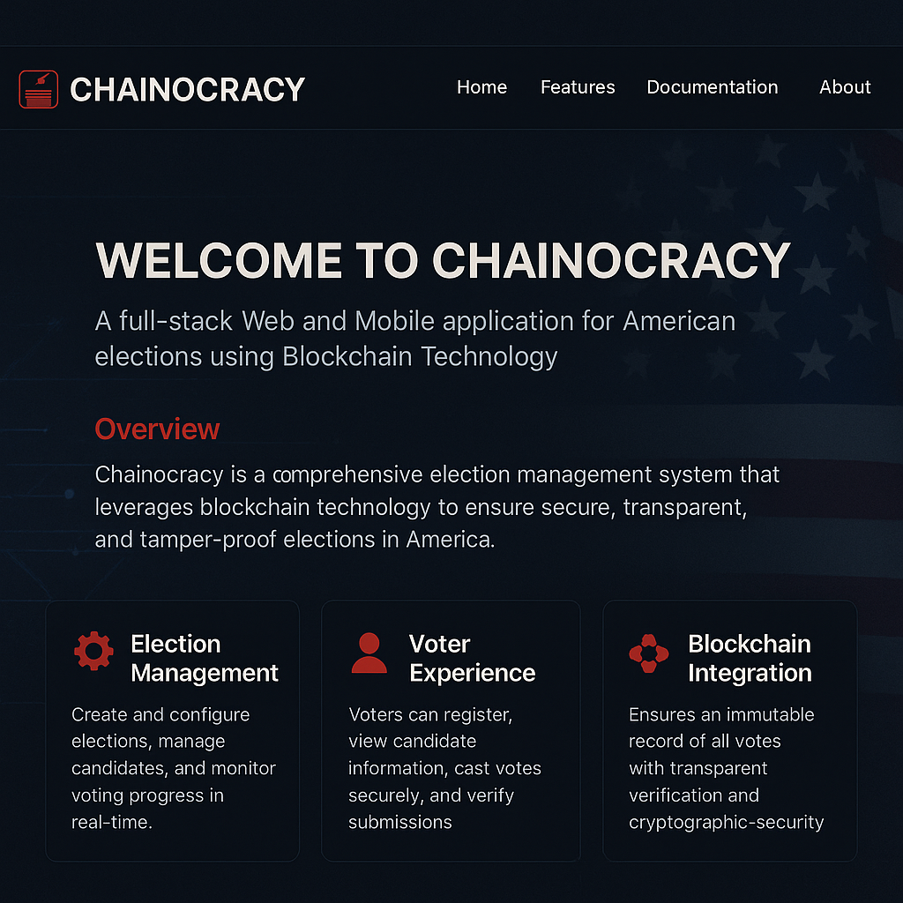

# Chainocracy

[](https://github.com/abrar2030/Chainocracy/actions)
[](https://codecov.io/gh/abrar2030/Chainocracy)
[](https://github.com/abrar2030/Chainocracy/blob/main/LICENSE)

A full-stack Web and Mobile application for American elections using Blockchain Technology. The system presents a user-friendly interface accessible via both web browsers and mobile platforms.

<div align="center">
  
</div>

> **Note**: This Project is currently under active development. Features and functionalities are being added and improved continuously to enhance user experience.

## Table of Contents
- [Overview](#overview)
- [Project Structure](#project-structure)
- [Features](#features)
- [Feature Implementation Status](#feature-implementation-status)
- [Technology Stack](#technology-stack)
- [Installation and Setup](#installation-and-setup)
- [Usage](#usage)
- [Testing](#testing)
- [Security](#security)
- [Documentation](#documentation)
- [Contributing](#contributing)
- [CI/CD Pipeline](#cicd-pipeline)
- [License](#license)

## Overview

Chainocracy is a comprehensive election management system that leverages blockchain technology to ensure secure, transparent, and tamper-proof elections in America. The platform consists of multiple components:

- **Web Frontend**: For election committee members and administrators
- **Mobile Frontend**: For voters to cast their votes securely
- **Backend API**: Handles business logic and blockchain operations
- **Blockchain Implementation**: Core technology ensuring election integrity

The system allows committee members to seamlessly access the application through their browsers, while voters have the convenience of utilizing their smartphones, whether running on iOS or Android.

## Project Structure

The project is organized into several main components:

```
chainocracy/
├── backend-api/           # Node.js/Express backend with blockchain implementation
├── docs/                  # Technical documentation and API references
├── mobile-frontend/       # React Native mobile application for voters
├── web-frontend/          # React web application for committee members
├── infrastructure/        # Deployment and infrastructure configuration
└── .github/workflows/     # CI/CD pipeline configurations
```

### Backend API

The backend is built with Node.js and TypeScript, providing RESTful APIs for both web and mobile clients. It includes:

- Blockchain implementation
- Authentication and authorization
- Election management
- Vote processing and verification
- Real-time updates via Socket.IO

### Web Frontend

A React-based web application with TypeScript and Tailwind CSS, designed for election committee members to:

- Manage elections
- Monitor voting progress
- View election results
- Manage candidates
- Verify voter identities
- Access blockchain details for transparency

### Mobile Frontend

A React Native application for voters that provides:

- Secure authentication
- Candidate information
- Voting interface
- QR code scanning for verification
- Real-time election updates
- Vote confirmation

### Documentation

Comprehensive documentation using Sphinx, including:

- API documentation
- System architecture
- User guides
- Security protocols

## Features

### Election Management
- Create and configure elections
- Set election parameters (start/end dates, eligible voters)
- Add and manage candidates
- Monitor election progress in real-time

### Voter Experience
- Secure voter registration and authentication
- View candidate information
- Cast votes securely
- Verify vote submission
- View election results

### Blockchain Integration
- Immutable record of all votes
- Transparent verification process
- Prevention of double-voting
- Cryptographic security
- Decentralized validation

### Security Features
- Two-factor authentication
- Encryption of sensitive data
- QR code verification
- Audit trails
- Secure key management

### Analytics and Reporting
- Real-time election statistics
- Voter turnout analysis
- Geographic voting patterns
- Result visualization
- Exportable reports

## Feature Implementation Status

| Feature | Status | Description | Planned Release |
|---------|--------|-------------|----------------|
| **Election Management** |
| Election Creation | ✅ Implemented | Create and configure new elections | v1.0 |
| Candidate Management | ✅ Implemented | Add and manage election candidates | v1.0 |
| Election Parameters | ✅ Implemented | Configure start/end dates and eligibility | v1.0 |
| Real-time Monitoring | 🔄 In Progress | Monitor election progress in real-time | v1.1 |
| **Voter Experience** |
| Voter Registration | ✅ Implemented | Register voters with secure verification | v1.0 |
| Authentication | ✅ Implemented | Secure login with 2FA | v1.0 |
| Vote Casting | ✅ Implemented | Cast votes securely | v1.0 |
| Vote Verification | ✅ Implemented | Verify vote submission | v1.0 |
| Result Viewing | 🔄 In Progress | View election results | v1.1 |
| **Blockchain Integration** |
| Vote Recording | ✅ Implemented | Record votes on blockchain | v1.0 |
| Verification Process | ✅ Implemented | Verify vote integrity | v1.0 |
| Double-vote Prevention | ✅ Implemented | Prevent duplicate voting | v1.0 |
| Decentralized Validation | 🔄 In Progress | Validate votes across nodes | v1.1 |
| **Security Features** |
| Two-factor Authentication | ✅ Implemented | Secure 2FA for users | v1.0 |
| Data Encryption | ✅ Implemented | Encrypt sensitive data | v1.0 |
| QR Code Verification | ✅ Implemented | Verify identity with QR codes | v1.0 |
| Audit Trails | 🔄 In Progress | Comprehensive logging | v1.1 |
| **Analytics and Reporting** |
| Election Statistics | 🔄 In Progress | Real-time statistics dashboard | v1.1 |
| Voter Turnout Analysis | 📅 Planned | Analyze voter participation | v1.2 |
| Geographic Patterns | 📅 Planned | Visualize voting patterns by region | v1.2 |
| Result Visualization | 🔄 In Progress | Interactive result displays | v1.1 |
| Exportable Reports | 📅 Planned | Export data in various formats | v1.2 |

**Legend:**
- ✅ Implemented: Feature is complete and available
- 🔄 In Progress: Feature is currently being developed
- 📅 Planned: Feature is planned for future release

## Technology Stack

### Backend
- **Runtime**: Node.js
- **Language**: TypeScript
- **Framework**: Express
- **Database**: LevelDB (for blockchain)
- **Authentication**: JWT, bcrypt
- **Real-time Communication**: Socket.IO
- **Other Libraries**: crypto-js, nodemailer, qrcode, speakeasy

### Web Frontend
- **Framework**: React
- **Language**: TypeScript
- **Styling**: Tailwind CSS, SCSS
- **State Management**: React Query
- **UI Components**: Radix UI, Material UI
- **Data Visualization**: Recharts, MUI X-Charts
- **Form Handling**: React Hook Form, Zod
- **Testing**: Vitest, Testing Library

### Mobile Frontend
- **Framework**: React Native (Expo)
- **Language**: TypeScript
- **Navigation**: React Navigation
- **UI Components**: React Native Paper
- **Authentication**: Expo Secure Store
- **Camera/QR**: Expo Camera, Expo Barcode Scanner
- **Other**: React Native SVG, Vector Icons

### Blockchain
- Custom implementation with:
  - Proof of Work consensus
  - Cryptographic hashing
  - Digital signatures
  - Distributed ledger
  - Smart contracts for election rules

## Installation and Setup

### Prerequisites
- Node.js (v16+)
- npm or yarn
- Expo CLI (for mobile development)
- Git

### Backend Setup
```bash
# Clone the repository
git clone https://github.com/abrar2030/chainocracy.git
cd chainocracy/backend-api

# Install dependencies
npm install

# Set up environment variables
cp .env.example .env
# Edit .env with your configuration

# Start development server
npm run dev
```

### Web Frontend Setup
```bash
cd ../web-frontend

# Install dependencies
npm install

# Start development server
npm run dev
```

### Mobile Frontend Setup
```bash
cd ../mobile-frontend

# Install dependencies
npm install

# Start Expo development server
npm start
```

## Usage

### Committee Member Portal (Web)
1. Access the web application through a browser
2. Log in with committee credentials
3. Set up elections, add candidates, and configure parameters
4. Monitor voting progress and results
5. Verify and validate election integrity through blockchain explorer

### Voter Application (Mobile)
1. Download and install the mobile application
2. Register or log in with voter credentials
3. View active elections and candidate information
4. Cast vote securely
5. Receive confirmation of vote submission
6. View election results when published

## Testing

The project includes comprehensive testing to ensure reliability and security:

### Unit Testing
- Backend: Jest for API and service testing
- Frontend: Vitest and React Testing Library for component testing
- Mobile: Jest and React Native Testing Library

### Integration Testing
- API endpoint integration tests
- Frontend-backend integration tests
- Blockchain transaction verification tests

### End-to-End Testing
- Cypress for web application flows
- Detox for mobile application flows

### Security Testing
- Penetration testing for API endpoints
- Smart contract auditing
- Authentication flow security testing

To run tests:

```bash
# Backend tests
cd backend-api
npm test

# Web frontend tests
cd web-frontend
npm test

# Mobile frontend tests
cd mobile-frontend
npm test
```

## Security

Chainocracy implements multiple layers of security:

- **Blockchain Technology**: Ensures immutability and transparency of votes
- **Encryption**: All sensitive data is encrypted at rest and in transit
- **Authentication**: Multi-factor authentication for all users
- **Authorization**: Role-based access control
- **Audit Trails**: Comprehensive logging of all system activities
- **Verification**: QR code and cryptographic verification of voter identity

## Documentation

Comprehensive documentation is available in the `docs` directory. To build and view the documentation:

```bash
cd docs
make html
```

## Contributing

We welcome contributions to Chainocracy! Please follow these steps:

1. **Fork the repository**
   - Create your own copy of the project to work on

2. **Create a feature branch**
   - `git checkout -b feature/amazing-feature`
   - Use descriptive branch names that reflect the changes

3. **Make your changes**
   - Follow the coding standards and guidelines
   - Write clean, maintainable, and tested code
   - Update documentation as needed

4. **Commit your changes**
   - `git commit -m 'Add some amazing feature'`
   - Use clear and descriptive commit messages
   - Reference issue numbers when applicable

5. **Push to your branch**
   - `git push origin feature/amazing-feature`

6. **Open a Pull Request**
   - Provide a clear description of the changes
   - Link to any relevant issues
   - Respond to review comments and make necessary adjustments

### Development Guidelines

- Follow the established code style and architecture
- Write unit tests for new features
- Update documentation for any changes
- Ensure all tests pass before submitting a pull request
- Keep pull requests focused on a single feature or fix

### Code Review Process

All submissions require review before being merged:

1. Automated checks must pass (CI/CD pipeline)
2. At least one maintainer must approve the changes
3. Any review comments must be addressed

## CI/CD Pipeline

Chainocracy uses GitHub Actions for continuous integration and deployment:

### Continuous Integration
- Automated testing on each pull request and push to main
- Code quality checks with ESLint and Prettier
- Test coverage reporting with Codecov
- Security scanning for vulnerabilities

### Continuous Deployment
- Automated deployment to staging environment on merge to main
- Manual promotion to production after approval
- Version tagging and release notes generation

Current CI/CD Status:
- Build: 
- Test Coverage: 
- Code Quality: 

## License

This project is licensed under the ISC License - see the [LICENSE](LICENSE) file for details.

---
