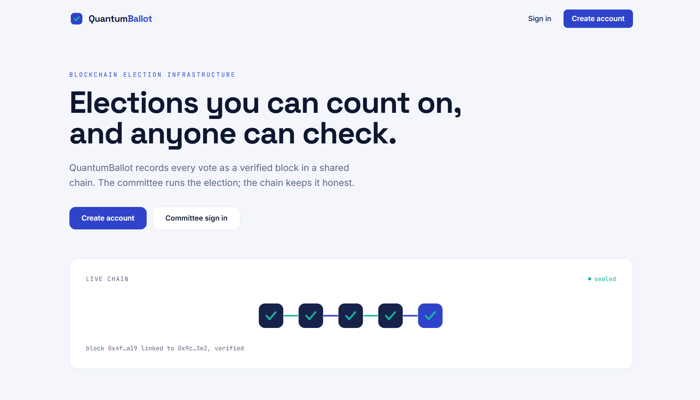

# QuantumBallot


## Blockchain-Based Election Management Platform

QuantumBallot is an election management platform: a Node.js/TypeScript backend running a genuine custom Proof-of-Work blockchain (LevelDB-backed, with real mining and a "smart contract" election-state machine), paired with a React web dashboard for committee members and a React Native (Expo) mobile app for voters, including real 2FA (speakeasy) and QR code verification.

<div align="center">
  
</div>

## Table of Contents

- [Overview](#overview)
- [Project Structure](#project-structure)
- [Feature Status](#feature-status)
- [Technology Stack](#technology-stack)
- [Architecture](#architecture)
- [Installation and Setup](#installation-and-setup)
- [Running the Stack](#running-the-stack)
- [API Surface](#api-surface)
- [Testing](#testing)
- [CI/CD Pipeline](#cicd-pipeline)
- [Documentation](#documentation)
- [Contributing](#contributing)
- [License](#license)

## Overview

QuantumBallot demonstrates an election workflow across a real, runnable codebase. The blockchain itself is a genuine custom implementation, not a wrapper around an existing chain: real SHA-256-based Proof-of-Work mining, a LevelDB-backed ledger, and a smart-contract-style election state machine (created, started, ended). A separate, substantial Rust implementation of the same voting logic (over 2,200 lines across two binaries) exists as a tested reference implementation but isn't called by the running Node.js backend.

## Project Structure

```
QuantumBallot/
├── code/
│   ├── backend/                  # Node.js/TypeScript (Express) API
│   │   ├── src/api/routes/       # blockchain, committee (also handles auth,
│   │   │                         # 2FA, and voter registration)
│   │   ├── src/committee/        # Committee logic, 2FA (speakeasy), QR (qrcode)
│   │   ├── src/network/          # Socket.IO server and a separate axios-based
│   │   │                         # peer-to-peer HTTP layer
│   │   ├── src/email_center/     # Email notifications
│   │   └── tests/                # Backend test suite
│   └── blockchain/               # The blockchain implementation
│       ├── src/core/             # BlockChain class: real SHA-256 Proof-of-Work
│       │                         # mining, block validation
│       ├── src/leveldb/          # LevelDB-backed persistence
│       ├── src/smart_contract/   # smart_contract.ts (used by the backend) plus
│       │                         # smart_contract.rs and voting_mechanisms.rs
│       │                         # (a separate, tested Rust reference
│       │                         # implementation, not called by the TS backend)
│       └── tests/                # Blockchain test suite
├── web-frontend/                 # React (TypeScript, Vite) dashboard
├── mobile-frontend/              # React Native (Expo, TypeScript) app
├── infrastructure/               # Docker, Kubernetes, Terraform, Ansible, monitoring
├── scripts/                      # Setup, build, deploy, and dev-workflow scripts
├── docs/                         # Documentation (this directory)
└── README.md
```

## Feature Status

### Application tier (wired and tested)

| Component                   | Details                                                                                                                                                                                               |
| :-------------------------- | :---------------------------------------------------------------------------------------------------------------------------------------------------------------------------------------------------- |
| **Custom blockchain**       | A real Proof-of-Work chain: SHA-256 mining with a configurable difficulty target, block validation, and LevelDB-backed persistence.                                                                   |
| **Election smart contract** | A genuine state machine (`smart_contract.ts`) tracking election lifecycle (created, started, ended), genuinely used by the API to create, run, and close elections.                                   |
| **Auth and 2FA**            | JWT-based sessions (separate verification middleware for web and mobile), plus real TOTP two-factor authentication (speakeasy) with QR code enrollment (`qrcode`).                                    |
| **Real-time updates**       | A genuine Socket.IO server in `network.ts`, separate from the peer-to-peer layer, which uses plain HTTP (axios) between blockchain nodes rather than WebSockets.                                      |
| **Committee API**           | Registration, login, logout (web and mobile variants), token refresh, and voter/candidate management, all under `/committee`. There is no separate `/auth` route; this is where authentication lives. |
| **Email notifications**     | Templated email sending for committee workflows.                                                                                                                                                      |
| **Web dashboard**           | React and TypeScript app (Vite, Tailwind CSS, Radix UI, Material UI, Recharts and MUI X-Charts, React Hook Form with Zod) for committee members to manage elections and view blockchain details.      |
| **Mobile app**              | React Native (Expo, TypeScript) app for voters, with React Native Paper, Expo Camera and Barcode Scanner for QR verification, and Expo Secure Store for credential storage.                           |

### Reference implementation (tested, not wired to the running application)

| Component               | Details                                                                                                                                                                                                                                                                                                  |
| :---------------------- | :------------------------------------------------------------------------------------------------------------------------------------------------------------------------------------------------------------------------------------------------------------------------------------------------------- |
| **Rust smart contract** | `smart_contract.rs` and `voting_mechanisms.rs` (over 2,200 lines combined), described in their own `Cargo.toml` as "Rust reference implementations of the QuantumBallot voting smart contract." They compile and have their own CI job, but the running backend calls the TypeScript version, not these. |

## Technology Stack

| Area                     | Technology                                                                                                 |
| :----------------------- | :--------------------------------------------------------------------------------------------------------- |
| Backend API              | Node.js, TypeScript, Express                                                                               |
| Blockchain               | Custom Proof-of-Work implementation, LevelDB, crypto-js (SHA-256)                                          |
| Reference implementation | Rust (a separate, tested but unintegrated reimplementation of the smart contract)                          |
| Auth                     | JWT, bcrypt, speakeasy (TOTP 2FA), qrcode                                                                  |
| Real-time                | Socket.IO                                                                                                  |
| Web frontend             | React, TypeScript, Vite, Tailwind CSS, Radix UI, Material UI, Recharts, MUI X-Charts, React Hook Form, Zod |
| Mobile frontend          | React Native, Expo, TypeScript, React Navigation, React Native Paper, Expo Camera, Expo Secure Store       |
| Infrastructure           | Docker, Kubernetes, Terraform, Ansible                                                                     |
| Monitoring               | Prometheus, Grafana                                                                                        |
| CI/CD                    | GitHub Actions                                                                                             |
| Testing                  | Jest (backend, blockchain, web, and mobile)                                                                |

## Architecture

```
Clients
  ├── web-frontend (React, TypeScript)     ── HTTP/Socket.IO ──┐
  └── mobile-frontend (React Native)      ── HTTP/Socket.IO ──┤
                                                              ▼
Backend (Express, Node.js/TypeScript)
  ├── Routes    /blockchain, /committee (also covers auth, 2FA, voter/candidate mgmt)
  ├── Network    Socket.IO server, plus a separate axios-based P2P layer for
  │              blockchain nodes
  └── Email       Templated notifications

Blockchain (code/blockchain)
  BlockChain (SHA-256 Proof-of-Work, LevelDB persistence)
  SmartContract (TypeScript, election state machine, used by the backend)
  Rust reference implementation (compiled and tested, not called by the backend)
```

See [docs/ARCHITECTURE.md](docs/ARCHITECTURE.md) for detail.

## Installation and Setup

Prerequisites: Node.js 16+, npm or yarn, and the Expo CLI for mobile development.

```bash
git clone https://github.com/abrar2030/QuantumBallot.git
cd QuantumBallot

# Backend
cd code/backend
npm install
cp .env.example .env
# edit .env with your configuration

# Web frontend
cd ../../web-frontend
npm install

# Mobile frontend
cd ../mobile-frontend
npm install
```

Full, environment-specific instructions are in [docs/INSTALLATION.md](docs/INSTALLATION.md).

## Running the Stack

```bash
# Full local stack (from infrastructure/, Docker required)
docker compose up -d

# Or run components individually:

# Backend (from code/backend)
npm run dev

# Web dashboard (from web-frontend)
npm run dev

# Mobile app (from mobile-frontend)
npm start
```

See [docs/USAGE.md](docs/USAGE.md) and [docs/CONFIGURATION.md](docs/CONFIGURATION.md).

## API Surface

| Group                               | Prefix        | Highlights                                                                                               |
| :---------------------------------- | :------------ | :------------------------------------------------------------------------------------------------------- |
| Blockchain                          | `/blockchain` | Chain state, block and transaction queries, node registration                                            |
| Committee (auth, voters, elections) | `/committee`  | Registration, login (web and mobile), logout, `refresh-token`, 2FA setup, voter and candidate management |

Full request and response shapes are in [docs/API.md](docs/API.md).

## Testing

```bash
# Backend (from code/backend)
npm test

# Blockchain (from code/blockchain)
npm test

# Rust reference implementation (from code/blockchain)
cargo test

# Web (from web-frontend)
npm test

# Mobile (from mobile-frontend)
npm test
```

The backend suite has 5 test files; the blockchain suite has 4. The web dashboard has 14 test files; the mobile app has 14.

## CI/CD Pipeline

GitHub Actions (`.github/workflows/cicd.yml`) runs four jobs on push, pull request, and manual dispatch:

| Job                         | Depends on          | What it does                                                                                                                                                                                 |
| :-------------------------- | :------------------ | :------------------------------------------------------------------------------------------------------------------------------------------------------------------------------------------- |
| Code Quality Checks         | -                   | Formatter checks across the repository                                                                                                                                                       |
| Backend Tests               | Code Quality Checks | Runs the Jest suite with coverage and uploads the coverage report as an artifact                                                                                                             |
| Smart Contract Tests (Rust) | Code Quality Checks | Compiles and tests the Rust reference implementation (`cargo build`, `cargo test`); this exercises the standalone Rust binaries, not the TypeScript smart contract the backend actually runs |
| Web Build                   | Code Quality Checks | Installs dependencies and produces the production web build (no test step)                                                                                                                   |

There is currently no CI job for the mobile app.

## Documentation

| Document                                           | Contents                               |
| :------------------------------------------------- | :------------------------------------- |
| [docs/README.md](docs/README.md)                   | Documentation index                    |
| [docs/ARCHITECTURE.md](docs/ARCHITECTURE.md)       | System architecture                    |
| [docs/API.md](docs/API.md)                         | REST API reference                     |
| [docs/INSTALLATION.md](docs/INSTALLATION.md)       | Setup for all components               |
| [docs/CONFIGURATION.md](docs/CONFIGURATION.md)     | Environment variables and config       |
| [docs/USAGE.md](docs/USAGE.md)                     | Running and using the platform         |
| [docs/CLI.md](docs/CLI.md)                         | Helper scripts reference               |
| [docs/FEATURE_MATRIX.md](docs/FEATURE_MATRIX.md)   | Feature status, implemented vs planned |
| [docs/TROUBLESHOOTING.md](docs/TROUBLESHOOTING.md) | Common issues and fixes                |
| [docs/CONTRIBUTING.md](docs/CONTRIBUTING.md)       | Contribution guide                     |
| [docs/examples/](docs/examples/)                   | Worked examples                        |

## Contributing

See [docs/CONTRIBUTING.md](docs/CONTRIBUTING.md).

## License

This project is licensed under the MIT License - see the [LICENSE](LICENSE) file for details.
